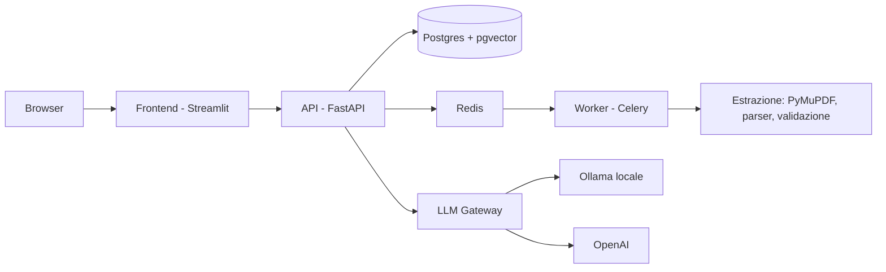

# 💼 EarnSight

[](https://github.com/gvector/EarnSight/actions/workflows/ci.yml)

**Analisi di cedolini paga italiani**: carichi i PDF, il sistema li elabora
con estrazione testuale + parser a regole + **validazione aritmetica
deterministica**, e i campi non corretti vengono risolti dall'utente o da un
**LLM** — con privacy by design (estrazione 100% locale, LLM locale come primario).

> I cedolini contengono dati sensibili: EarnSight li elabora senza mandarli
> a nessun provider esterno se non su esplicita scelta dell'utente.

---

## Cosa fa

| Funzionalità | Come |
|--------------|------|
| **Upload PDF** | Cedolini e Certificazioni Uniche; elaborazione asincrona (Celery + Redis) |
| **Estrazione** | PyMuPDF (testo + coordinate), template detection per firma layout, parser a regole per label |
| **Validazione** | Controlli aritmetici deterministici: netto+trattenute=lordo, somma voci vs totali, periodo valido |
| **Revisione** | I campi con problemi si correggono a mano via UI **oppure** si chiedono all'LLM (fallback mirato) |
| **Analytics** | trend storico, confronti mensili, alert anomalie *(Fase 3)* |
| **Chat agentica** | skill/tool + RAG su KB fiscale + anonimizzazione PII *(Fase 4)* |

## Architettura



Principi architetturali (vedi `CONTEXT.md` per la lingua del dominio):

- **ExtractionResult** — contratto tipizzato unico parlato da pipeline, worker,
  API e frontend (`backend/app/services/extraction/result.py`)
- **apply_to_document** — un solo owner della proiezione sul documento (JSONB,
  colonne, status)
- **dispatch_processing** — la decisione "Celery o inline" vive in un solo posto
- Session factory iniettabile: la path estrazione→persistenza è testata su
  sqlite, senza Postgres né Redis

## Stack

Python 3.12 · FastAPI · SQLAlchemy 2 · Alembic · Celery/Redis · PyMuPDF ·
Streamlit · Postgres (+pgvector per il RAG futuro) · GitHub Actions CI

## Quickstart

```bash
cp .env.example .env         # personalizza credenziali e segreti
docker compose up --build    # porta su api (8000), frontend (8501)

# primo login: credenziali da AUTH_USERNAME / AUTH_PASSWORD nel .env
open http://localhost:8501
```

Comandi utili: `make up · make logs · make migrate · make test · make lint`.

### Sviluppo locale senza Docker

```bash
python -m venv .venv && .venv/bin/pip install -r backend/requirements.txt -r backend/requirements-dev.txt
pytest                       # 36 test, nessun servizio esterno richiesto
ruff check backend tests frontend
```

## API principali

| Endpoint | Uso |
|----------|-----|
| `POST /api/auth/login` | login (JWT) |
| `POST /api/payslips/upload` | upload PDF (cedolino/CU) + avvio elaborazione |
| `GET /api/payslips[/{id}]` | lista / dettaglio (voci, segnalazioni, testo estratto) |
| `PATCH /api/payslips/{id}/fields` | correzione manuale dei campi segnalati |
| `POST /api/payslips/{id}/llm-resolve` | risoluzione dei campi via LLM |
| `GET/PUT /api/settings` | provider LLM + API key (cifrata a riposo, Fernet) |

## Pipeline di elaborazione

1. Upload → volume locale
2. Il worker estrae **testo + coordinate** (PyMuPDF); PDF scannerizzati → `needs_ocr`
3. **Template detection** (firma layout) → parser a regole per campi canonici e voci
4. **Validazione aritmetica**: errori → segnalazioni con azione suggerita
   (`user` o `llm`), confidenza declassata sui campi problematici
5. Persistenza (JSONB + `payslip_entry`) e revisione da UI o API

## Privacy & sicurezza

- Estrazione ed elaborazione: **solo locali**
- API key OpenAI **cifrata a riposo** (Fernet, chiave derivata da `SECRET_KEY`),
  mai restituita all'utente, mai in chiaro nel DB
- Login JWT obbligatorio; FK `user_id` predisposta per il multi-tenant
- Con Ollama locale: nessun dato esce dalla macchina

## Roadmap

- [x] Fase 0 — scaffolding, stack Docker, CI, auth
- [x] Fase 1 — core parsing: estrazione, validazione aritmetica, correzioni utente/LLM
- [x] Fase 2 — UI Streamlit (login, upload, cedolini, revisione, impostazioni)
- [ ] Fase 3 — analytics + query engine condiviso + analyst agent
- [ ] Fase 4 — chat agentica + RAG fiscale + anonimizzazione PII
- [ ] Fase 5 — proiezioni fiscali, OCR per scan, multi-utente, deploy online

## Testing

36 test: parser su PDF sintetici, validazione aritmetica, contratto
`ExtractionResult` (roundtrip JSONB), **path completa estrazione→persistenza
su sqlite** (session factory iniettata), dispatch Celery/inline, settings con
chiavi cifrate. CI su ogni push: ruff + pytest + build immagini.
